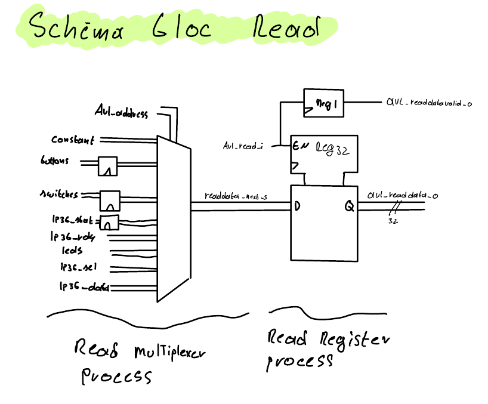

# Laboratoire 03 – Conception d’une interface simple

**Cours :** Architecture des systèmes embarqués (ARE)  
**Étudiants :** Colin Jaques, Theodros Mulugeta  
**Date :** 10 novembre 2024  

---

HEIG-VD

# Table des matières

1. [Introduction](#introduction)
2. [Plan d'adressage](#plan-dadressage)
   - [Plan d'adressage final](#plan-dadressage-final)
3. [Conception](#conception)
   - [Schéma de principe](#schéma-de-principe)
   - [Gestion de l'écriture](#gestion-de-lécriture)
   - [Gestion de la lecture](#gestion-de-la-lecture)
   - [Gestion du LP36 spécifique](#lp36-spécifique)
4. [Avalon](#avalon)
   - [Lecture](#lecture)
   - [Écriture](#écriture)
5. [Implémentation](#implémentation)
   - [Description globale](#description-globale)
   - [Synthèse des processus](#synthèse-des-processus)
   - [Points forts de l'implémentation](#points-forts-de-limplémentation)
   - [Résumé des signaux principaux](#résumé-des-signaux-principaux)
6. [Simulation de l'interface](#simulation-interface)
7. [Code C](#code-c)
8. [Conclusion](#conclusion)

# Introduction

Ce rapport présente le travail réalisé dans le cadre du troisième laboratoire du cours "Architecture des systèmes embarqués (ARE)", intitulé "Conception d’une interface simple". L'objectif principal de ce laboratoire est de concevoir et implémenter une interface matérielle connectée au bus Avalon pour contrôler divers périphériques de la carte DE1-SoC, ainsi qu'une liaison parallèle vers une carte Max10_leds. Le rapport détaille les différentes étapes de la conception, de la simulation et des tests, tout en mettant en évidence les choix techniques effectués pour répondre aux spécifications demandées.

 
 
 
 
 
 
 
 
 
 
 
 

# Plan d'adressage

Afin de concevoir notre interface, nous avons dû élaborer un plan d'adressage permettant de définir les méthodes d'accès entre le CPU et le FPGA.

La taille de la zone disponible pour l'interface correspond à 14 bits d'adresse, car la plage définie s'étend de 0x01_0000 à 0x01_FFFF, ce qui représente un espace total de 64 Ko. 

Cependant, seuls 14 bits sont nécessaires pour adresser un registre du côté FPGA. En effet, l'adressage se fait par blocs de 4 octets (32 bits) et non par octets individuels. Par conséquent, les deux bits de poids faible des adresses ne sont pas utilisés dans l'adressage côté FPGA. Cela réduit le nombre effectif de bits nécessaires, rendant 14 bits suffisants pour couvrir l'ensemble de la plage de 64 Ko.

Lors de la conception de notre plan d'adressage, nous avons cherché à rendre celui-ci adaptable et modulable. La plage d'adresses disponible étant largement suffisante pour nos besoins, nous l'avons divisée en plusieurs sections. 

- **Première partie (0x4000 à 0x401F)** : dédiée à des registres en lecture seule. Seules certaines adresses de cette plage sont utilisées, tandis que les autres sont réservées pour de potentielles extensions futures.  
- **Deuxième partie (0x4020 à 0x403F)** : dédiée à des registres en lecture/écriture.  
- **Dernière partie (0x4040 à 0x7FFF)** : laissée libre et non réservée, car elle n'est pas utilisée dans notre conception actuelle.

Pour les registres où seuls certains bits parmi les 32 bits sont utilisés, nous avons décidé de mettre les bits inutilisés à 0. Cette approche permet d'éviter les problèmes de lecture ou d'écriture dans des zones non définies et simplifie la gestion des données, en supprimant la nécessité d'appliquer des masques lors des opérations de lecture. 

## Plan d'adressage final

| **CPU**                        | **FPGA**           | **Commment**          | **Read**                         | **Write**                 |
|--------------------------------|--------------------|-----------------------|----------------------------------|---------------------------|
| `0xFF21 0000`                  | `0x4000`           | ID constant           | `Constant[31:0]`                 | Reserved                  |
| `0xFF21 0004`                  | `0x4001`           | Buttons               | `res[31:4]  => 0 buttons[3:0]`   | Reserved                  |
| `0xFF21 000C`                  | `0x4003`           | Switches              | `res[31:10] => 0 switches[9:0]`  | Reserved                  |
| `0xFF21 0010`                  | `0x4004`           | LP36 status           | `res[31:2]  => 0 lp36-stat[1:0]` | Reserved                  |
| `0xFF21 0014`                  | `0x4005`           | LP36 ready            | `res[31:1]  => 0 lp36-rdy[0]`    | Reserved                  |
| `0xFF21 0018 -> 0x00FF21 007C` | `0x4006 -> 0x401F` |                       | Reserved                         | Reserved                  |
| `0xFF21 0080`                  | `0x4020`           | Leds                  | `res[31:10] => 0 leds[9:0]`      | `res[31:10] leds[9:0]`    |
| `0xFF21 0084`                  | `0x4021`           | LP36 sel              | `res[31:4]  => 0 lp36_sel[3:0]`  | `res[31:4] lp36_sel[3:0]` |
| `0xFF21 0088`                  | `0x4022`           | LP36 data             | `lp36_data[31:0]`                | `lp36_data[31:0]`         |
| `0xFF21 008C -> 0x00FF21 00FC` | `0x4023 -> 0x403F` |                       | Reserved                         | Reserved                  |
| `0xFF21 0100 -> 0x00FF21 FFFF` | `0x4040 -> 0x7FF`  |                       | Free                             | Free                      |

 
 
 
 
 
 
 
 
 
 
 
 

# Conception
Ce chapitre a pour objectif de présenter notre conception de l'interface matérielle, en mettant en évidence les différents blocs fonctionnels et les interactions entre eux. Nous détaillerons également les spécifications de chaque bloc, ainsi que les choix techniques effectués pour répondre aux exigences du laboratoire.

## Schéma de principe

Ce schéma représente l'architecture générale de notre interface matérielle. Nous avons identifié trois blocs principaux, chacun ayant un rôle spécifique dans le fonctionnement de l'interface :

1. **Gestion de l'écriture** : Ce bloc a pour rôle de gérer les demandes d'écriture provenant du CPU. Il permet d'écrire dans trois registres distincts :  
   - Un registre pour les LEDs,  
   - Un registre pour le mode de sélection du LP36,  
   - Un registre pour les données du LP36.  

2. **Gestion de la lecture** : Ce bloc s'occupe des demandes de lecture effectuées par le CPU. Il décode les adresses provenant du CPU afin de rediriger les informations appropriées sur le bus de données de lecture. Ce bloc gère également le bit indiquant au bus Avalon que les données en lecture sont prêtes et valides.

3. **Gestion du LP36 (LP36 management)** : Ce bloc prend en charge le cycle d'écriture des données vers le LP36. La carte MAX10 impose une contrainte spécifique : le cycle d'écriture doit durer au moins 1 μs. Ainsi, lorsqu’une transmission de données via l'interface parallèle de la carte MAX10 est nécessaire, le signal `write_enable` de la carte MAX10 doit être activé pendant au moins 1 μs. Pendant cette période, il est essentiel que les données restent stables pour éviter toute corruption.

Certaines données sont transmises entre les différents blocs pour assurer leur coordination :  
- **Transfert des valeurs des registres d'écriture** : Le bloc d'écriture transmet les valeurs des registres au bloc de lecture, permettant ainsi au CPU de relire l’état des sorties.  
- **Retour du bit `lp36_ready`** : Ce bit est envoyé au bloc de lecture pour être accessible par le CPU. Il est également transmis au bloc d’écriture afin de contrôler l’activation des registres et d’éviter toute corruption des données pendant une opération d’écriture vers la carte MAX10.

## Avalon

Le bus Avalon est utilisé pour la communication entre le CPU et le FPGA. Sa description complète est spécifiée dans les consignes de ce laboratoire. Ce bus permet de gérer des adresses de lecture et d'écriture, des données associées, ainsi que des signaux de contrôle et de validation. Un signal spécifique doit être manipulé du côté FPGA pour indiquer si les données en lecture sont valides.

### Lecture

Pour la lecture, nous avons opté pour l'utilisation d'un multiplexeur. Celui-ci, piloté par les adresses de lecture, sélectionne les données à renvoyer sur le bus de données. Les entrées asynchrones provenant du LP36 ou des E/S de la carte MAX10 sont synchronisées à l'aide d'un flip-flop afin d'éviter des problèmes de synchronisation.

Un registre 32 bits est utilisé pour stocker temporairement les données à transmettre sur le bus. Ce registre est mis à jour en fonction des adresses de lecture reçues. Une fois les données insérées dans le registre, le bit de validation de lecture est activé pour informer le CPU que les données sont prêtes à être lues. 

### Écriture

Pour l'écriture, nous avons utilisé un décodeur qui, en fonction de l'état du bus d'adresses, redirige les données d'écriture vers le registre approprié. Ce décodeur est piloté par les adresses d'écriture. Les données à écrire sont stockées dans des registres dédiés, qui servent ensuite à mettre à jour les sorties correspondantes.

- **Registre des LEDs** : Son écriture est inconditionnelle, c'est-à-dire qu'aucune restriction n'empêche sa mise à jour.  
- **Registres du LP36** : Le registre de l'état du LP36 et celui des données du LP36 ne peuvent être modifiés que s'ils ne sont pas en cours de lecture par la carte MAX10. Cette restriction permet d'éviter les conflits ou la corruption des données lors d'une opération de lecture parallèle.

Les registres utilisés ont des tailles adaptées pour ne stocker que les données nécessaires, ce qui permet une utilisation optimisée des ressources. 

 
 
 
 
 
 
 
 
 
 
 
 
 
 
 
 
 
 
 

## LP36 spécifique

Afin de permettre les opérations de lecture et d'écriture sur le bus parallèle de communication de la carte MAX10, un bloc spécifique a été conçu. En effet, le cycle d'écriture doit durer au moins 1 μs. Lorsqu'une transmission de données via l'interface parallèle de la carte MAX10 est nécessaire, le signal `write_enable` doit être maintenu actif pendant au moins 1 μs. Pendant cette période, il est impératif que les données restent stables pour éviter toute corruption.

Pour répondre à cette spécification, nous avons mis en place un système de protection des registres, empêchant leur modification durant une écriture en cours. Nous avons également créé un signal, `lp36_ready_o`, qui informe le CPU de la disponibilité du LP36 pour une nouvelle écriture.

Cependant, cette méthode présentait une problématique : il semblait impossible d'écrire simultanément le mode et les données sans devoir attendre la fin du cycle d'écriture. Pour résoudre ce problème, nous avons décidé de séparer les blocages pour l'écriture du mode et des données. Ainsi, il est possible d'écrire d'abord le mode, puis les données dans le même cycle d'écriture. Lorsque l'écriture est effectuée sur l'une des deux parties (mode ou données), le compteur de durée d'écriture est remis à zéro. Cela garantit que la durée minimale d'écriture de 1 μs est toujours respectée.

Le chronogramme ci-dessous illustre le fonctionnement de l'écriture sur le LP36.

### Description des signaux

- **CPU** : Action effectuée par le CPU.  
- **DATA** : Données contenues dans le registre `data`, transmises au LP36.  
- **SEL** : Données contenues dans le registre `sel`, transmises au LP36.  
- **rdy** : Bit indiquant si une écriture est possible sur le LP36 (égal à `not we_o`).  
- **we_sel** : Bit indiquant s'il est possible d'écrire dans le registre `sel`.  
- **we_data** : Bit indiquant s'il est possible d'écrire dans le registre `data`.  
- **we_o** : Signal `write_enable` envoyé au LP36 (égal à `we_sel` ou `we_data`).  
- **counter** : Compteur indiquant le temps écoulé depuis le début du cycle d'écriture.  

---

---

---

Le comportement de ce système est décrit à l'aide d'une machine d'état simple. Cette machine d'état gère les différentes transitions nécessaires pour respecter les contraintes d'écriture. 

- Lorsqu'une écriture est initiée par le CPU et qu'elle concerne un registre de communication avec le LP36, une transition est effectuée : le signal `write_enable` est activé et le compteur est démarré.  
- Une fois que le compteur atteint la durée requise (1 μs), le signal `write_enable` est désactivé et le compteur est remis à zéro.  
- Si, pendant un cycle d'écriture, une nouvelle demande d'écriture est effectuée sur un registre différent du précédent, le signal `write_enable` reste activé et le compteur est réinitialisé à zéro pour garantir la durée minimale requise.  
- En revanche, si une nouvelle demande d'écriture concerne le même registre que lors de l'écriture en cours, aucune action n'est prise : les données ne sont pas prises en compte pour éviter tout conflit ou corruption.

Cette gestion garantit que les contraintes matérielles spécifiques au LP36 sont respectées, tout en assurant une utilisation correcte des registres sans perte de données ni conflits. 

Voici une section complète pour expliquer comment la valeur de 50 cycles a été déterminée, à intégrer directement dans ton rapport :

### Calcul du délai minimum pour le cycle LP36

La carte MAX10 impose une contrainte matérielle : chaque cycle d'écriture sur le bus parallèle de la carte LP36 doit durer **au moins 1 μs**. Cela signifie que le signal `write_enable` doit rester actif pendant cette durée minimale. Afin de respecter cette spécification, nous avons dû convertir cette contrainte temporelle en cycles d'horloge en tenant compte de la fréquence du bus Avalon.

#### Fréquence du bus Avalon
Le bus Avalon fonctionne avec une horloge de **50 MHz**, soit une période d'horloge de :

\[
T_{\text{Avalon}} = \frac{1}{\text{Fréquence}} = \frac{1}{50 \times 10^6} = 20 \, \text{ns par cycle.}
\]

#### Durée minimale imposée par la carte LP36
La durée minimale pour le cycle d'écriture est de :

\[
T_{\text{LP36}} = 1 \, \mu s = 1 \times 10^{-6} \, \text{s.}
\]

#### Nombre de cycles d'horloge nécessaires
Le nombre de cycles nécessaires pour respecter cette durée est calculé en divisant la durée minimale par la période d'horloge :

\[
\text{Nombre de cycles} = \frac{T_{\text{LP36}}}{T_{\text{Avalon}}} = \frac{1 \times 10^{-6}}{20 \times 10^{-9}} = 50 \, \text{cycles.}
\]

#### Implémentation dans le design
Pour garantir que le signal `write_enable` respecte cette durée, nous avons utilisé un **compteur 6 bits** (capable de compter jusqu'à 63) dans notre design. Ce compteur incrémente à chaque cycle d'horloge du bus Avalon, et le signal `write_enable` reste actif tant que le compteur n'a pas atteint la valeur 50. Une fois ce seuil atteint, le compteur est remis à zéro, et l'écriture est terminée.

 
 
 
 
 
 
 
 
 
 
 
 
 
 

# Implémentation

L'implémentation de ce design a été réalisée dans un fichier VHDL nommé `avl_user_interface.vhd`. Ce fichier regroupe les différents blocs fonctionnels nécessaires au fonctionnement de l'interface Avalon pour la gestion des communications entre le CPU et le FPGA. L'architecture met en œuvre trois principales fonctionnalités : la gestion de la lecture, la gestion de l'écriture et la gestion spécifique du LP36.

## Description globale

Le fichier est organisé autour de plusieurs processus, chacun étant dédié à un rôle précis. Ces processus interagissent pour gérer les lectures et écritures via le bus Avalon, tout en respectant les spécifications du laboratoire. Voici les différents processus et leur rôle :

### 1. **Lecture**
   - **Processus de synchronisation des entrées** : Les signaux entrants asynchrones, tels que les boutons, les interrupteurs ou l'état du LP36, sont synchronisés à l'horloge `avl_clk_i` pour éviter les problèmes liés aux changements de signal hors synchronisation.
   - **Multiplexeur de lecture** : Ce processus sélectionne les données à renvoyer sur le bus Avalon en fonction de l'adresse en cours (`avl_address_i`). Les données sélectionnées sont ensuite stockées dans un registre dédié.
   - **Registre de lecture** : Un registre temporaire est utilisé pour mémoriser les données à lire. Ce registre s'assure que les données restent stables tant qu'elles ne sont pas lues par le CPU. Un signal de validation (`avl_readdatavalid_o`) informe le CPU que les données sont prêtes.

### 2. **Écriture**
   - **Décodage des adresses** : Un décodeur analyse les adresses d'écriture (`avl_address_i`) pour rediriger les données vers le registre approprié.  
   - **Registres d'écriture** : Chaque type de donnée (LEDs, mode LP36, données LP36) possède un registre dédié. Ces registres permettent de stocker les données reçues jusqu'à leur transmission ou utilisation.  
   - **Protection contre les conflits** : Pour les registres liés au LP36, des contrôles supplémentaires empêchent leur modification lorsque des opérations critiques, telles qu'une transmission en cours, sont en cours.

### 3. **Gestion du LP36**
   - **Compteur de cycle d'écriture** : Ce processus surveille la durée des cycles d'écriture pour garantir que le signal `write_enable` reste actif pendant au moins 1 μs, comme spécifié par la carte MAX10. Un compteur incrémente à chaque cycle d'horloge, et un signal de fin (`counter_done_s`) indique lorsque la durée requise est atteinte.
   - **Machine à états** : Une machine à états contrôle le signal `write_enable` en fonction des commandes reçues et de l'état actuel des registres. Les transitions entre états (telles que `WE_DATA`, `WE_SEL` ou `WE_BOTH`) permettent de gérer l'écriture des données et du mode de manière séquentielle sans conflit.

## Synthèse des processus

| **Processus**            | **Rôle**                                                                                     |
|---------------------------|---------------------------------------------------------------------------------------------|
| **sync_input_reg**        | Synchronisation des signaux entrants asynchrones (boutons, interrupteurs, statut LP36).     |
| **read_decoder**        | Sélection des données à lire via un multiplexeur basé sur l'adresse.                        |
| **read_register**       | Stockage et validation des données lues pour le CPU.                                        |
| **write_register**      | Décodage des adresses d'écriture et gestion des registres dédiés.                           |
| **counter**               | Gestion du compteur pour garantir une durée minimale d'écriture sur le LP36.               |
| **mss_state_reg**         | Machine à états pour gérer les signaux `write_enable` et éviter les conflits.               |
| **mss_fut_dec**           | Détermine les transitions d'états en fonction des commandes et des états actuels.           |

## Points forts de l'implémentation

- **Modularité** : Chaque fonctionnalité est isolée dans un processus distinct, ce qui facilite la maintenance et l'évolution du design.  
- **Protection contre les conflits** : Les mécanismes intégrés garantissent la cohérence des écritures, même en cas de demandes simultanées ou conflictuelles.  
- **Respect des spécifications matérielles** : La gestion du signal `write_enable` et des temps critiques est conforme aux exigences de la carte MAX10.

## Résumé des signaux principaux

- **`avl_readdatavalid_o`** : Signal de validation des données lues pour le CPU.  
- **`lp36_rdy_s`** : Indique si le LP36 est prêt pour une nouvelle écriture.  
- **`lp36_we_o`** : Signal `write_enable` pour les opérations avec le LP36.  
- **`counter_done_s`** : Indique la fin d'un cycle d'écriture de 1 μs.

# Simulation interface

## Opération de base de lecture et d'écriture :

Dans l'exemple ci-dessous, plusieurs opérations de lecture et d'écriture sont effectuées. Tout d'abord, une première lecture de la constante est réalisée. Les boutons sont ensuite testés, ainsi que les switches, dont la valeur est initialement définie à 0x0000000F. La seconde lecture affiche la même valeur, bien qu'elle ait été réinitialisée à zéro auparavant, ceci est dû à un problème avec la simulation cependant le chronogramme confirme cette valeur. Ensuite, une écriture est effectuée pour activer les leds, puis une seconde pour les éteindre.

## Maintient du signal lp36_we_o durant 1us :

Le signal `lp36_we_o` est maintenu actif pendant une durée de 1 µs, permettant ainsi au périphérique d'effectuer une lecture sans interférence. Cette approche permet au périphérique de lire des données stables et cohérentes, sans risque de corruption due à une écriture simultanée.

## Désactivation de l'écriture lors d'une lecture par la max 10 :

Dans la simulation ci-dessous, on observe que la seconde instruction d'écriture `avl_write_i`, qui contient des données composées uniquement de 0, n'est pas prise en compte; la valeur 0xFFFFFFFF est maintenue malgré la tentative d'écriture. Cela permet d'éviter toute corruption des données pendant la lecture.

## Reset du counter :

Dans la simulation ci-dessous, on observe que le compteur se réinitialise correctement à 0 lorsque l'écriture sur le signal `lp36_sel_reg_s` est suspendue pour permettre l'écriture des données (`lp36_data_reg_s`). Cette vérification est validée par le fait que le signal `write_i` passe à 1 à 460 ns et que le signal `lp36_we_o` est maintenu actif jusqu'à 1538 ns. Un délais de 1us est donc ajouté.

## Test sur DE1-SoC et Max 10

Afin de confirmer le bon fonctionnement des opérations simulées, des tests ont été réalisés directement sur la carte DE1-SoC et la carte Max 10. Ces tests en conditions réelles ont permis de vérifier la cohérence des résultats observés en simulation. 

Le comportement a pu être validé, notamment le maintien des signaux, la réinitialisation du compteur et l'activation des LEDs, se produisent correctement. Cette étape assure la fiabilité des interactions entre les différents composants du système dans un environnement physique.

# Code C

Nous avons ensuite implémenté un programme permettant d'intéragir avec notre interface. Ce programme est relativement simple et ressemble au programme du laboratoire précédent. Il n'y a rien de spécial à signaler. A part le fait que nous avons décidé, lors de l'écriture sur la LP36, d'effectuer une boucle d'attente contrôlant le bit `lp36_rdy` pour s'assurer que le LP36 est prêt pour une nouvelle écriture. Si elle ne l'est pas, le programme attend au maximum 50us.

# Conclusion

Ce laboratoire nous a permis de concevoir et d'implémenter une interface matérielle efficace entre un CPU et un FPGA, en respectant les contraintes spécifiques du bus Avalon et de la carte MAX10. 

À travers ce projet, nous avons acquis une meilleure compréhension des interactions entre les différents composants matériels et appris à structurer un plan d'adressage modulable et extensible. La conception et l'implémentation de notre interface ont également mis en lumière l'importance de la synchronisation des signaux asynchrones, la gestion des temps critiques, et la protection contre les conflits d'accès.

Grâce à une machine à états bien définie et à l'organisation modulaire de notre code VHDL, nous avons pu garantir un fonctionnement fiable et conforme aux spécifications demandées. Les tests effectués ont confirmé la robustesse de notre design et sa capacité à gérer des scénarios complexes d'accès concurrentiel aux registres.

Enfin, cette expérience nous a permis de renforcer nos compétences en conception de systèmes embarqués et en interaction matérielle. Nous sommes satisfaits des résultats obtenus, qui illustrent l'importance d'une conception soignée et méthodique dans le domaine de l'architecture des systèmes embarqués.
